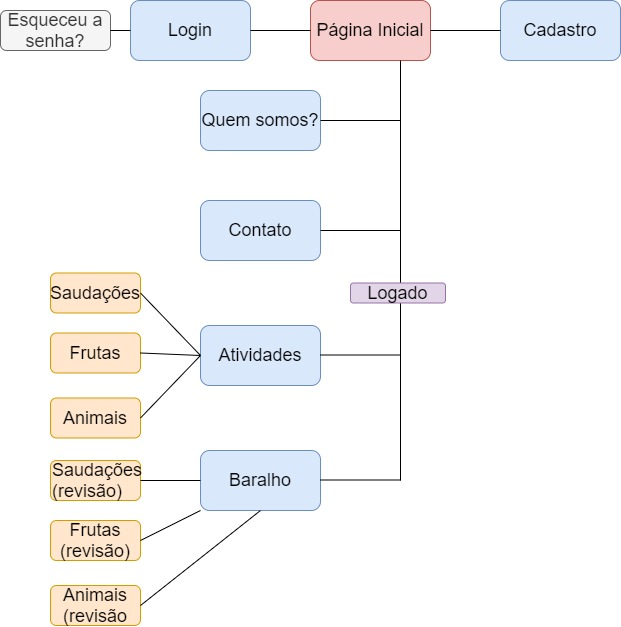
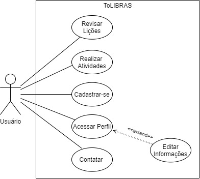

# Documentos
- [Documentos](#documentos)
- [Mapa do site](#mapa-do-site)
- [Casos de uso](#casos-de-uso)
- [Descrição do casos de uso (lista)](#descrição-do-casos-de-uso-lista)
- [Documento de visão](#documento-de-visão)
- [Documento de requisitos](#documento-de-requisitos)

# Mapa do site

# Casos de uso

# Descrição do casos de uso (lista)
- Login
- Realizar tarefa
- Montar Grupo

# Documento de visão

* **Descrição do problema:**

|         |            | 
| ------------- |:-------------:|
| **O problema da**      | Falta de investimento na política de inclusão aos surdos e deficientes auditivos no meio acadêmico. | 
| **Afeta**      | Pessoas ouvintes, deficientes auditivos e surdos.     |
| **Cujo impacto é** | A dificuldade no processo de ensino-aprendizagem.      |
| **Uma boa solução seria** | Criação de um site, como o ToLIBRAS, que ensine, de forma lúdica, alguém que não tenha domínio da linguagem.      |

*  **Descrição dos usuários:**

|   Nome      |   Descrição    |   Responsabilidade   | 
| ------------- |:-------------:|:-------------:|
| User      | Usuário que poderá acessar o conteúdo de aprendizagem do ToLIBRAS, para que o mesmo estude LIBRAS.  |   O User será, em suma, o usuário principal do site, visto que a criação do mesmo visa em ajudar pessoas que têm interesse em aprender LIBRAS.    |
| Administrador      | Um user que criou um grupo de users para competir entre eles as tarefas que o próprio definiu.|   Definir as tarefas para cada membro para competir.    |

* **Descrição do ambiente dos usuários:**

    Pela razão do ToLIBRAS ser um site, o ambiente de usuário é amplo e pode ser qualquer e todo lugar, desde que haja acesso à
internet e a um navegador.

* **Principais necessidades dos usuários:**

    A imprescindibilidade de aprender LIBRAS para os ajudar na comunicação com deficientes auditivos, seja em ambiente escolar, de
trabalho ou acadêmico. Outra necessidade que o usuário possuirá, ainda, será um site que ensine de forma eficaz, rápida e gratuita, a linguagem
de sinais.

* **Alternativas concorrentes:**

    Atualmente, há o site InLIBRAS (inLIBRAS.com.br). Esse site foi desenvolvido por alunos do curso de ciência da computação e foca
suas funções em torno do público infantil surdo e público ouvinte (com ajuda para aprender LIBRAS). Além disso, é apresentado ao usuário
diversas informações a respeito da Língua Brasileira de Sinais. É um site com muito foco em informar o usuário, auxiliando tanto surdos quanto
ouvintes na informação quanto à surdez ou deficiência auditiva. Entretanto, o InLIBRAS é limitado na questão de ensinar aos ouvintes sobre
LIBRAS, tendo apenas dois ambientes apresentados (parque e cozinha).
    
   Outros que também ideias semelhantes seriam o StorySign, que ensina uma criança com problema auditivo a ler histórias infantis,
o VLIBRAS, que traduz, por meio de um avatar, um texto selecionado de português para LIBRAS, e, por último, o Hand Talker, que auxilia pessoas
que não sabem LIBRAS através de videoaulas sobre um assunto especifico. 

* **Visão geral do produto:**

     O ToLIBRAS é uma plataforma online e gratuita que tem como principal função ensinar o usuário a aprender LIBRAS, por meio de
atividades (separadas por categorias) referentes a temas essenciais no aprendizado de um novo idioma.
     
   A metodologia utilizada pelo site seria a Gamificação, utilizando mecanismos e características de jogos, tendo como recompensas
por concluir tarefas e punições por errá-las, para motivar e facilitar o aprendizado aos usuários. 

# Documento de requisitos

   **1) Visão geral de produto:**

   O ToLIBRAS é uma plataforma online e gratuita que tem como principal
   função ensinar o usuário a aprender LIBRAS, por meio de atividades (separadas por categorias)
   referentes a temas essenciais no aprendizado de um novo idioma. A metodologia utilizada pelo site
   seria a Gamificação, utilizando mecanismos e características de jogos, tendo como recompensas
   por concluir tarefas e punições por errá-las, para motivar e facilitar o aprendizado aos usuários.

   **2) Requisitos funcionais**

   |     Código    |     Nome       |     Descrição      |     Categoria (Evidente/Oculto)       |
   |:-------------:|:-------------:|:-------------:|:-------------:|
   | RF1 | Editar perfil. |    Editar informações pessoais do perfil.    |  Evidente   |
   | RF2 | Fazer login/cadastro.   |    Realizar cadastro/acessar perfil logado.    |  Evidente   |
   | RF3 | Adicionar amigos.    |   Adicionar amigos para acompanhar seus progressos.   |  Evidente   |
   | RF4 | Realizar os exercícios.      |    Realizar os exercícios disponibilizados pelo ToLIBRAS.    |  Evidente   |
   
   **3) Requisitos não-funcionais**
   
   |     Código    |     Nome       |     Descrição      |     Categoria      |     Classificação      |
   |:-------------:|:-------------:|:-------------:|:-------------:|:-------------:|
   | RNF1 | Protocolo HTTPS. |    Protocolo seguido nas páginas web.    |  Segurança   |  Obrigatório   |
   | RNF2 | Animações Javascript.   |    Animações para dinamizar o ambiente da plataforma.    |  Desenvolvimento   |  Desejável   |
   | RNF3 | Criptografar informações pessoais.    |   Proteger informações pessoais.   |  Segurança   |  Obrigatório   |
   | RNF4 | Linguagem ASP.NET   |    Todo o sistema deve ser feito com a linguagem ASP.   |  Implementação   |  Obrigatório   |
   | RNF5 | Somente para navegadores   |    O site deve funcionar, preferencialmente, em um navegador.   |  Portabilidade   |  Obrigatório   |
   | RNF6 | Backup do sistema   |    O sistema deverá gerar um backup a cada 24 horas.   |  Segurança   |  Desejável   |
   | RNF7 | Model, View, Controller   |    O site terá como padrão o modelo MVC em suas páginas.   |  Padrão   |  Obrigatório   |
   | RNF8 | Design responsivo   |    O site se adaptará em qualquer dispositivo como PC, Celular, Tablet.   |  Usabilidade   |  Obrigatório   |
   
   **4) Tabela de referência de requisitos FUNCIONAIS x requisitos NÃO FUNCIONAIS**
   
   |     /    |     RNF1     |     RNF2      |     RNF3     |     RNF4     |     RNF5     |     RNF6     |     RNF7     |     RNF8     |
   |:-------------:|:-------------:|:-------------:|:-------------:|:-------------:|:-------------:|:-------------:|:-------------:|:-------------:|
   | RF1 | X | X | X | X | X | X | X | X |
   | RF2 | X |  | X | X | X |  | X | X |
   | RF3 | X | X |  | X | X | X | X | X |
   | RF4 | X | X |  | X | X | X | X | X |
